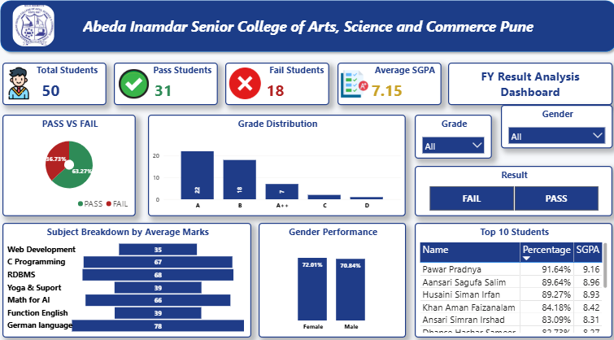
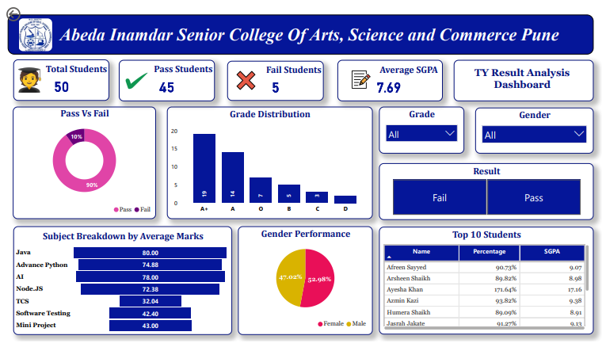
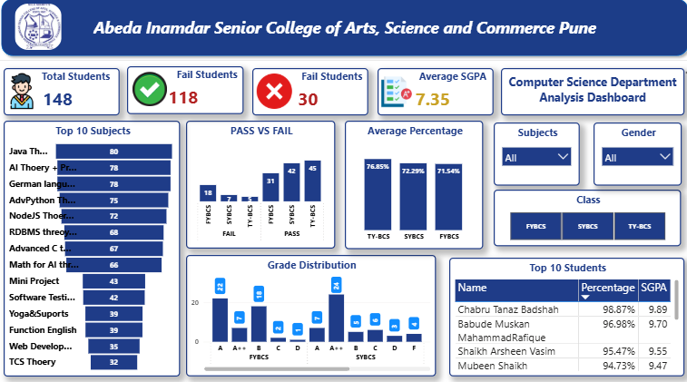

# 🎓 Abeda Inamdar CS Department Result Analysis Dashboard
An interactive **Power BI Result Analytics Dashboard** built to analyze the academic performance of the **Computer Science Department** at **Abeda Inamdar Senior College of Arts, Science and Commerce, Pune**. This project converts **official result PDFs** into structured data, performs **error handling + data cleaning**, and presents insights through **class-wise dashboards (FY/SY/TY)** and a **final comparison dashboard** for smarter academic analysis.

---

## 📌 Project Overview  
The **Result Analysis Dashboard** helps understand:

✔ Total students, pass students, fail students (FY/SY/TY)  
✔ Average SGPA and performance trends  
✔ Pass vs Fail analysis (class-wise)  
✔ Grade distribution insights  
✔ Subject-wise average marks / subject performance  
✔ Gender-wise performance comparison  
✔ Top 10 students (ranked by % / SGPA)  
✔ Final dashboard for **FY vs SY vs TY comparison**

Instead of checking PDF results manually, this dashboard provides a clean, interactive and visual way to explore department performance.

---

## 🎯 Objective  
The goal of this project is to:

1) Convert official result PDFs into analysis-ready structured data (Excel)  
2) Practice a real-world workflow: **data collection → error identification → cleaning → reporting**  
3) Identify performance patterns across **FY, SY, TY**  
4) Compare pass/fail, grades, SGPA and subject performance across classes  
5) Build a Power BI dashboard that supports **academic decision-making**

---

## 🛠️ Tech Stack Used  
📊 **Power BI Desktop** – Dashboard creation & interactive visualizations  
📂 **Power Query** – Data cleaning, transformations, formatting  
🧠 **DAX (Data Analysis Expressions)** – Measures/KPIs (Pass %, Avg SGPA, etc.)  
📁 **Microsoft Excel** – Manual data entry + structured dataset creation  
📝 **Data Modeling** – Master table + relationships/filtering logic  
🖼 **PNG Export** – Dashboard preview for documentation  

---

## 📂 Data Source  
The dataset was created from the **Computer Science Department’s official result PDFs**.

Process followed:

1) Took result PDFs for **FY, SY, TY**  
2) Manually entered data into Excel (student-wise)  
3) Intentionally added errors for practice (data quality simulation)  
4) Verified each other’s entries, corrected mistakes, and cleaned the dataset  
5) Used the cleaned dataset in Power BI to build dashboards  

> Note: FY/SY/TY have different subjects, but the overall structure and dashboard logic remains the same.

---

## 📊 Dashboard Features & Insights  

### 🔢 Key Performance Indicators (KPIs)  
Includes major metrics such as:  
- Total Students  
- Pass Students  
- Fail Students  
- Average SGPA  

These KPIs give a quick snapshot of class performance.

---

### 🟢 Pass vs Fail Analysis  
- Visual comparison of **Pass vs Fail** for each class  
➡ Helps quickly evaluate overall result performance.

---

### 🏅 Grade Distribution  
- Distribution of grades (A++, A, B, C, D, etc.) class-wise  
➡ Helps understand how performance is spread across categories.

---

### 📚 Subject-wise Performance (Average Marks)  
- Subject breakdown by average marks  
➡ Helps identify strong and weak subjects (class-wise).

---

### 👥 Gender-wise Performance  
- Comparison of performance across **Male vs Female**  
➡ Useful for understanding performance patterns by gender.

---

### 🏆 Top 10 Students  
- List of top students with **Percentage** and **SGPA**  
➡ Highlights high achievers for each class.

---

### 📈 Final FY vs SY vs TY Comparison Dashboard  
- Combined dashboard to compare FY, SY, TY on key metrics  
➡ Helps understand overall department progression across years.

---

## 💡 Insights Derived (Examples)  
✔ Clear view of pass rate differences between FY, SY, TY  
✔ Identifies grade pattern changes across classes  
✔ Helps spot subjects with low average performance  
✔ Makes it easy to compare gender-wise outcomes  
✔ Highlights toppers and their SGPA/% consistently

(You can edit this section after finalizing your conclusions.)

---

## 📷 Dashboard Preview  
Add your screenshots here:

```md




```

---

## 👨‍💻 Contributors  
- [Mubeen Shaikh](https://github.com/mubeenshaikh2006)
- [Simran Sayyed](https://github.com/simransayyed2005)
- [Azmin Kazi](https://github.com/azminkazi)

---


